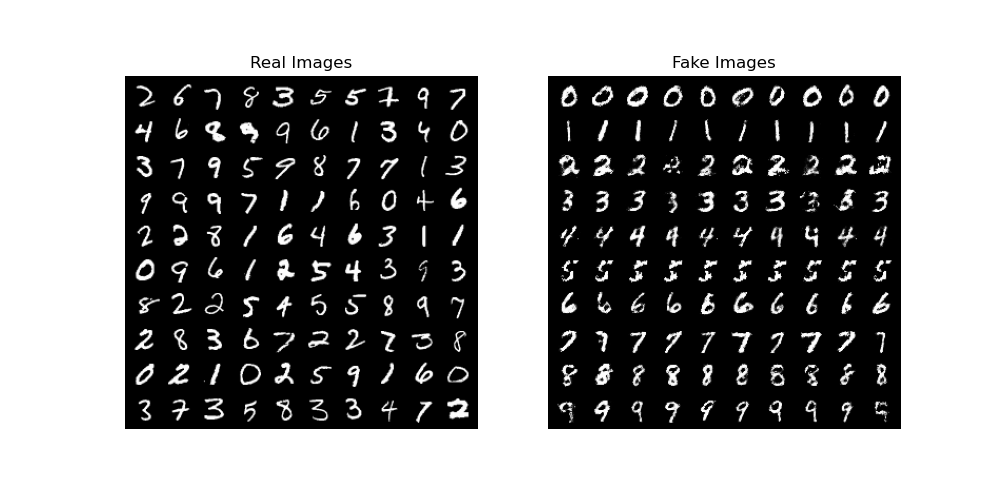

# Conditional Generative Adversarial Network (CGAN)
한국어 버전의 설명은 [여기](./docs/README_ko.md)를 참고하시기 바랍니다.

## Introduction
A Conditional Generative Adversarial Network (CGAN) is a generative model aimed at creating new data that satisfies specific conditions.
CGAN is an extension of the vanilla GAN, with the addition of conditions during training.
In the case of MNIST, labels from 0 to 9 are provided as conditions, and CGAN learns to generate data corresponding to each label.
The sequential changes in results during the learning process can be visualized as a GIF file.
Additionally, to verify the quality of the generated data, [the Fréchet Inception Distance (FID) score](https://github.com/mseitzer/pytorch-fid) can be used.
For more information on CGAN, please refer to the [Conditional Generative Adversarial Network (CGAN)](https://ljm565.github.io/contents/CGAN1.html) article.
<br><br><br>

## Supported Models
### Conditional GAN
A CGAN using `nn.Linear` is implemented.
<br><br><br>

## Base Dataset
* Base dataset for tutorial is [MNIST](http://yann.lecun.com/exdb/mnist/).
* Custom datasets can also be used by setting the path in the `config/config.yaml`.
However, implementing a custom dataloader may require additional coding work in `src/utils/data_utils.py`.
<br><br><br>

## Supported Devices
* CPU, GPU, multi-GPU (DDP), MPS (for Mac and torch>=1.12.0)
<br><br><br>

## Quick Start
```bash
python3 src/run/train.py --config config/config.yaml --mode train
```
<br><br>

## Project Tree
This repository is structured as follows.
```
├── configs                         <- Folder for storing config files
│   └── *.yaml
│
└── src      
    ├── models
    |   └── cgan.py                  <- CGAN model file
    |
    ├── run                   
    |   ├── cal_fid.py              <- Codes for calculating FID score
    |   ├── train.py                <- Training execution file
    |   └── validation.py           <- Trained model evaulation execution file
    | 
    ├── tools    
    |   ├── pytorch_fid             <- Codes for calculating FID score
    |   |   ├── fid_score.py
    |   |   └── inception.py
    |   |
    |   ├── model_manager.py          
    |   └── training_logger.py      <- Training logger class file
    |
    ├── trainer                 
    |   ├── build.py                <- Codes for initializing dataset, dataloader, etc.
    |   └── trainer.py              <- Class for training, evaluating, and calculating FID score
    |
    └── uitls                   
        ├── __init__.py             <- File for initializing the logger, versioning, etc.
        ├── data_utils.py           <- File defining the custom dataset dataloader
        ├── filesys_utils.py       
        └── training_utils.py     
```
<br><br>

## Tutorials & Documentations
Please follow the steps below to train the CGAN.
1. [Getting Started](./docs/1_getting_started.md)
2. [Data Preparation](./docs/2_data_preparation.md)
3. [Training](./docs/3_trainig.md)
4. ETC
   * [Evaluation](./docs/4_model_evaluation.md)
   * [FID Calculation](./docs/5_calculate_fid.md)

<br><br><br>


## Training Results
* Results of CGAN<br><br>
<br><br>
<br><br>
<br><br><br>

